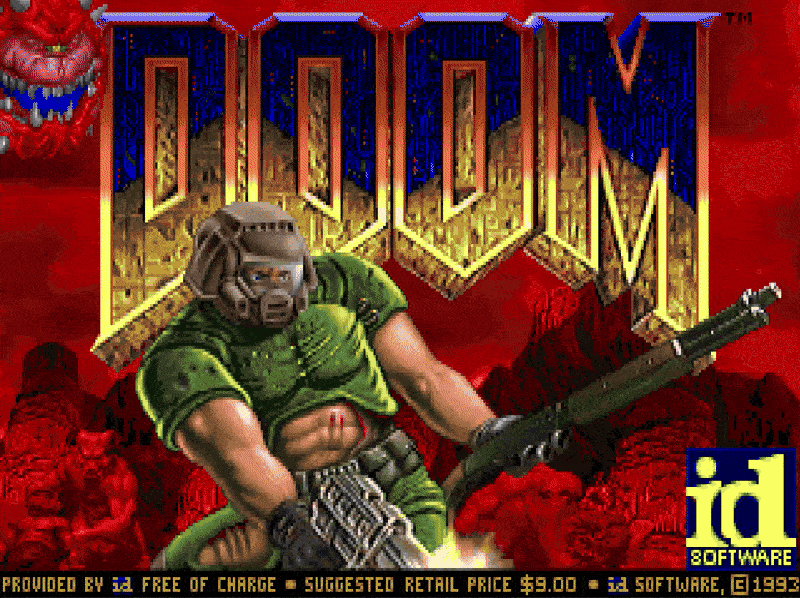

<p align="center">

</p>

<table>
<tr>
<td valign="top" width="280">


</td>
<td valign="top">

```properties
╭─ cheesecake@github ──────────────────────────────────╮
│                                                      │
│   os       cs undergrad                             │
│   wm       wanna be systems dev                     │
│   shell    building tools that help people build    │
│   theme    catppuccin mocha                         │
│   editor   vscode + vim                             │
│                                                      │
╰──────────────────────────────────────────────────────╯
```

</td>
</tr>
</table>

---

### 🛠️ tech stack

<p align="center">


</p>

---

### 📊 github stats

<!-- Using github-profile-summary-cards - most reliable service -->
<p align="center">
<a href="https://github.com/cheese-cakee">
  
</a>
</p>

<p align="center">
<a href="https://github.com/cheese-cakee">
  
</a>
<a href="https://github.com/cheese-cakee">
  
</a>
</p>

<p align="center">
<a href="https://github.com/cheese-cakee">
  
</a>
<a href="https://github.com/cheese-cakee">
  
</a>
</p>

<!-- GitHub Streak using DenverCoder1's reliable instance -->
<p align="center">
<a href="https://github.com/cheese-cakee">
  
</a>
</p>

---

### 🏆 holopin badges

<p align="center">
<a href="https://holopin.io/@cheesecakee"></a>
</p>

---

### 📈 contribution graph

<p align="center">

</p>

---

### 🎮 doom e1m1

<p align="center">

```
╭─ real playable doom ─────────────────────────────────────────────────────────────────╮
│                                                                                      │
│  this is actually doom running on github. click the ▶ play button at the top        │
│  right of the gif to start playing. use the navigation links to move around.        │
│                                                                                      │
╰──────────────────────────────────────────────────────────────────────────────────────╯
```

<a href="menu/episode_1.md"></a>

</p>

---

<p align="center">

</p>
