<p align="center">


<table>
<tr>
<td valign="top" width="280">


</td>
<td valign="top">

```properties
╭─ cheesecake@github ─────────────────────────────────────────────────────────────╮
│                                                                                 │
│  profile   CS undergrad | systems , infra , inference , dev tools               │
│  trust     LFX Mentee @hiero-ledger, Under maintainer guidance @Ceph            │
│  impact    merged PRs in CRIU , Rizin , Prometheus and more                     │
│  strength  C/C++ systems work, Python                                           │
│  workflow  no slop, reproducible fixes, fast review turnaround, clean commits   │
│                                                                                 │
╰─────────────────────────────────────────────────────────────────────────────────╯
```

</td>
</tr>
</table>

---

### selected work

- **[Lucebox inference engine](https://github.com/Luce-Org/lucebox/pulls?q=is%3Apr+author%3Acheese-cakee)** · AMD GPU inference  
  Worked on heterogeneous DeepSeek-V4 execution across Radeon R9700 and Strix Halo, including grouped MoE batching, cross-device overlap, fused expert reduction, and graph-cache correctness. Selected work: [#640](https://github.com/Luce-Org/lucebox/pull/640) and [#647](https://github.com/Luce-Org/lucebox/pull/647) merged; [#658](https://github.com/Luce-Org/lucebox/pull/658) and [#676](https://github.com/Luce-Org/lucebox/pull/676) under review.

- **[LFX Mentorship 2026 · Hiero](https://gist.github.com/cheese-cakee/fc4dbfd6297af59eacf7bcb54618dffe)** · ongoing  
  Contributing across the Python and C++ SDKs, with work spanning runtime behavior, CI reliability, security hardening, and maintainer tooling.

- **[Selected systems and infrastructure contributions](https://gist.github.com/cheese-cakee/6229f95d4c9f3ce641577f40e64dbbf8)**  
  Work across Ceph, CRIU, Rizin, Prometheus, and other open-source projects.

---

### some stuff I know

<p align="center">


</p>

---

### github stats

<!-- GitHub Stats - generated daily by .github/workflows/profile-stats.yml -->
<p align="center">
<a href="https://github.com/cheese-cakee">
  
</a>
<a href="https://github.com/cheese-cakee">
  
</a>
</p>

---

<p align="center">

</p>
