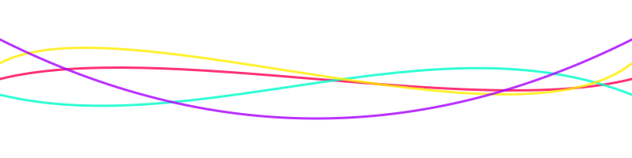

  <!-- ======================================================= -->
  <!--               LAYER 1: THE ANIME CHAOS                  -->
  <!-- ======================================================= -->

  <!-- Large Banner -->
  

  <!-- Glitch Header -->

  

  <h3 align="center"> 𝓦𝓮𝓵𝓬𝓸𝓶𝓮 𝓽𝓸 𝓶𝔂 𝔀𝓸𝓻𝓵𝓭 𝓸𝓯 𝓬𝓸𝓭𝓮 !</h3>

  <!-- Anime Greeting Table -->
  <table align="center" border="0" cellspacing="0" cellpadding="0">
    <tr>
      <td align="center" valign="center">
        <!-- Spagetti Overlay -->
        
      </td>
      <td align="center" valign="center" width="400">
         <h3>Hey there! I'm Farzan.</h3>
         
CS Undergrad | System Dev | Chaos Enthusiast

         
<i>"I like building stuff which help people build stuff"</i>

         <!-- Holopin -->
         
      </td>
    </tr>
  </table>

 
 

  <!-- ======================================================= -->
  <!--               LAYER 2: THE DOOM ARCADE                  -->
  <!-- ======================================================= -->

  <h2>🕹️  SYSTEM OVERRIDE: PROTOCOL DOOM  🕹️</h2>
  
<b>CLICK THE SCREEN BELOW TO START THE SIMULATION</b>

  
  
   
  <i>(Powered by GitHub Stateless Engine)</i>

 
 

  <!-- ======================================================= -->
  <!--               LAYER 3: THE COCKPIT (STATS)              -->
  <!-- ======================================================= -->

  <h2>📊 CONTROL PANEL</h2>

  <!-- Tech Stack -->
  

    
    
    
    
    
    
    
    
    
    
    
    
    
    
    
    
    
    
    
    
    
  

  <!-- GitHub Stats Table -->
  <table align="center">
    <tr>
      <td></td>
      <td></td>
    </tr>
  </table>

  <!-- Visit Count -->
  

    
  

