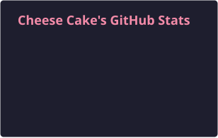
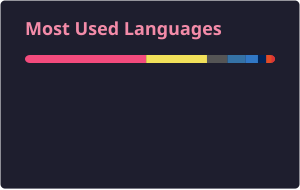

<p align="center">


<table>
<tr>
<td valign="top" width="280">


</td>
<td valign="top">

```properties
╭─ cheesecake@github ─────────────────────────────────────────────────────────────╮
│                                                                                 │
│  profile   CS undergrad | systems, inference, dev tools                         │
│  trust     LFX Mentee @hiero-ledger, ex contract inference engineer @lucebox    │
│  impact    merged PRs in vLLM, Ceph, CRIU, Rizin, Prometheus, lucebox           │
│  strength  C/C++ systems, GPU inference (CUDA, HIP), model serving              │
│  workflow  exact-output checks, matched benchmarks, clean commits               │
│                                                                                 │
╰─────────────────────────────────────────────────────────────────────────────────╯
```

</td>
</tr>
</table>

---

### my work so far

- **[Lucebox inference engine](https://github.com/Luce-Org/lucebox/pulls?q=is%3Apr+author%3Acheese-cakee+is%3Amerged)** · contract inference engineer, 2026  
  24 merged PRs in a C++ CUDA/HIP inference engine: DeepSeek-V4 MoE prefill across two AMD GPUs (2.02x on a 401-token prompt, byte-identical output), a fused MoE combine kernel, HIP wave64 correctness, and a CUDA-graph replay fix.

- **[LFX Mentorship 2026 · Hiero](https://github.com/hiero-hackers/sdk-automations)** · ongoing  
  Building sdk-automations, one GitHub App that runs contributor-facing automation for the Hiero SDK repositories from repository-owned config: signature-verified webhooks, crash-safe SQLite processing, and checks that stop it acting on stale state. Before the mentorship: CI bots and tests in the Python and C++ SDKs.

- **[Systems and infrastructure](https://gist.github.com/cheese-cakee/6229f95d4c9f3ce641577f40e64dbbf8)** · merged fixes in Ceph (RGW), CRIU, Rizin, and Prometheus.

---

### some stuff I know

<p align="center">


</p>

---

### github stats

<!-- GitHub Stats - generated daily by .github/workflows/profile-stats.yml -->
<p align="center">
<a href="https://github.com/cheese-cakee">
  
</a>
<a href="https://github.com/cheese-cakee">
  
</a>
</p>

---

<p align="center">

</p>
